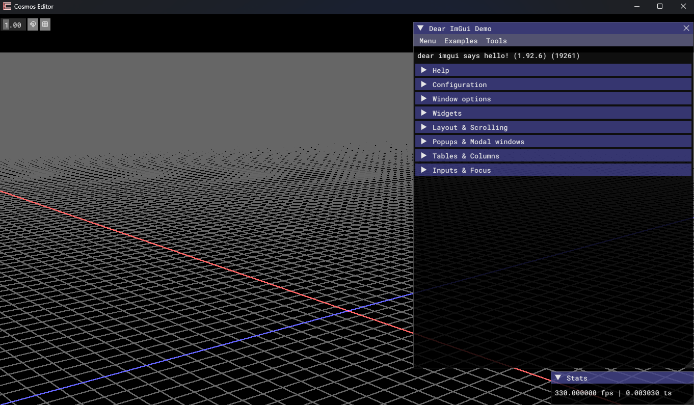
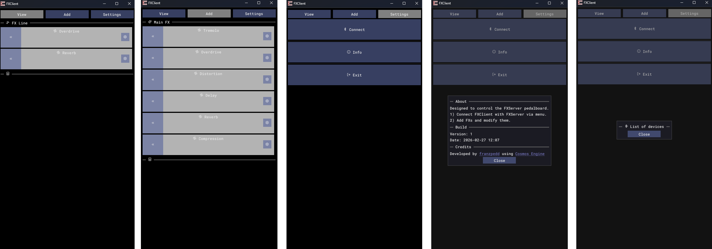
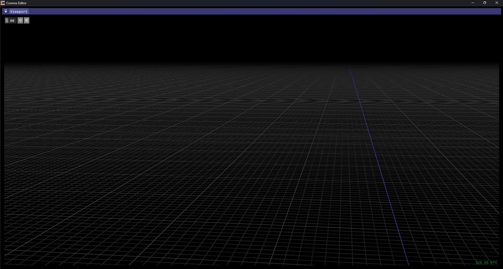

## About
Cosmos is a 3D renderer/framework engine for developing applications on multi-platforms. It's currently on early stages of development with desktop development as the priority.

## Getting started
At the momment the best advice is to check the Editor's application. Soon there will be a "blank" sample project for starting a new project as well as more "complete" projects for reference.

Cosmos uses CMake to manage and build all projects used and Cosmos itself.
You must have Git installed as dependencies are cloned using it.

Clone the repo with:
```bash
git clone https://github.com/franzpedd/cosmos
```

Go to it's directory:
```bash
cd cosmos
```

Create a Build folder
```bash
mkdir Build
```

Use CMake to build:
```bash
cmake ..
```

The solution files (depending on your current system) will be generated under "Build" folder.

## Progress
As development goes I'll try to update visually on how the project is, features, tests and releases. Currently there isn't much to show.
The grid system is implemented (initial stage).


There are some projects to get your started on how to use the framework/engine.
Desktop projects will be generated alongisde CMake building process. Android projects will have necessary files included for opening in Android Studio.
They're not exactly state of the art but serves well as an example.

<p align="center">
    
</p>
<p align="center"> ResCalc Android </p>

<p align="center">
     
</p>
<p align="center"> ResCalc Desktop </p>

## Thirdparty
* [CMake](https://cmake.org/): Build System;
* [EVK](https://github.com/franzpedd/evk): Vulkan Renderer;
* [SDL3](https://github.com/libsdl-org/SDL): Window Manager;
* [ImGui](https://github.com/ocornut/imgui): Graphical Interface;
* [Lucide](https://lucide.dev/icons/) && [Font Awesome](https://fontawesome.com/): Icons library;