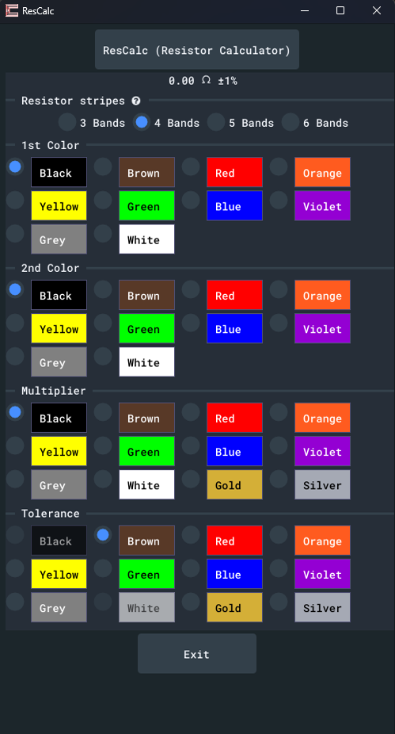
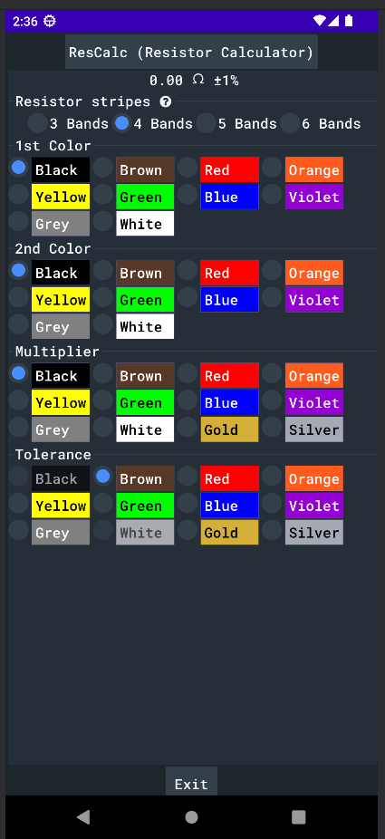
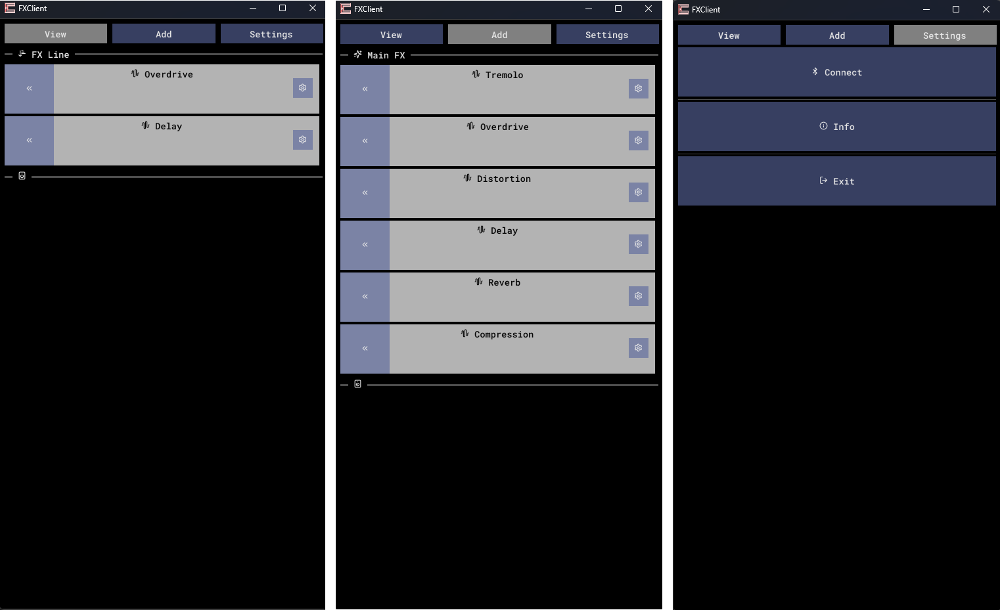
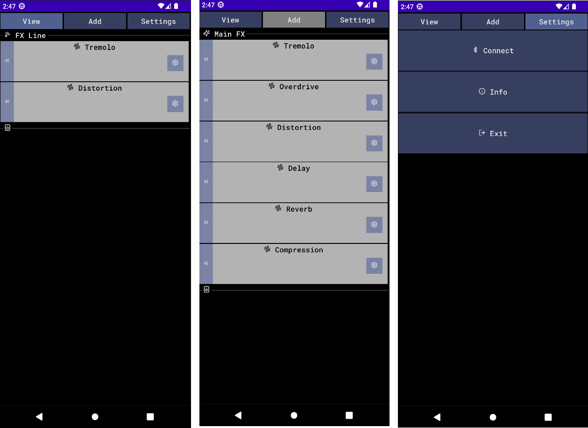

## About
Cosmos is a 3D renderer/framework engine for developing applications on multi-platforms. It's currently on early stages of development but already works on Windows and Android. Linux support will be the next major thing to address.

## Getting started
Cosmos uses CMake to manage and build all projects used and Cosmos itself.
You must have Git installed as dependencies are cloned using it.

Clone the repo with:
```bash
git clone https://github.com/franzpedd/cosmos
```

Go to it's directory:
```bash
cd cosmos
```

Create a Build folder
```bash
mkdir Build
```

Use CMake to build:
```bash
cmake ..
```

The solution files (depending on your current system) will be generated under "Build" folder.

## Project: Editor (Desktop)
As development goes I'll try to update visually on how the project is, features, tests and releases. Currently there isn't much to show.
The grid system is implemented (initial stage).


## Project: Rescalc (Android/Desktop)
This project is just a simple working example of a resistor calculator, the code used on both android and desktop is the same, not similar.
<p align="center">
    
</p>
<p align="center">
    
</p>

## Project: FXClient (Android/Desktop)
This project is just an unfinished example of a project, in the future it'll include Java code and contain comunication with C++ code via JNI, and just maybe become a full product.
<p align="center">
    
</p>
<p align="center">
    
</p>

## Todo/Fix list
This is not a complete fix, but a reminder for myself to fix some issues.
* Export vecmath and any other library correctly;
* Project creator: App for creating a Cosmos project;

## License and Thirdparty
As Cosmos itself embraces other projects you must be aware their license as well. They are all permissive enough for redistribution, selling and modifing without any issue (just proper credits).

* [EVK](https://github.com/franzpedd/evk) / Undecided: Vulkan Renderer.    
* [SDL3](https://github.com/libsdl-org/SDL) / [zlib License](https://www.libsdl.org/license.php): Window Manager.
* [ImGui](https://github.com/ocornut/imgui) / [MIT License](https://github.com/ocornut/imgui/blob/master/LICENSE.txt): Graphical Interface.
* [Roboto](https://fonts.google.com/specimen/Roboto+Mono/license) / [ SIL Open Font License, Version 1.1](https://fonts.google.com/specimen/Roboto+Mono/license): Text font.
* [Lucide](https://lucide.dev/icons/) / [ISC License](https://lucide.dev/license) Icons font.

Cosmos itself has not a license yet.